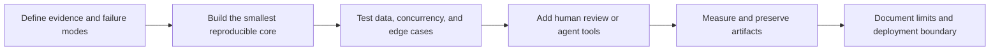

# Jiapeng Li

### Computer Vision · Data-Centric AI · Agent Tooling · Backend Engineering

I build inspectable AI systems around models: dataset recovery, human review, evidence-oriented tools, reproducible experiments, and deployment workflows.

## Featured engineering work

### 1. YOLO Label Recovery: auditable data recovery and team review

An end-to-end human-in-the-loop system for recovering missing YOLO labels with multiple single-class teacher models.

- Enumerates GT/AUTO relationships with IoU, IoS, center distance, area ratio, duplicate detection, and cross-class conflict evidence.
- Streams six teacher models sequentially to control GPU and host memory pressure.
- Provides a Vue 3 + Spring Boot + MySQL review platform with JWT/RBAC, project membership, **image-level atomic claiming**, renewable group leases, optimistic versions, and immutable audit events.
- Completed a real review round of **30,183 candidates** and exports immutable decisions for dataset regeneration and 5090 retraining.
- Verified by Python tests, backend integration tests, frontend builds, operational runbooks, and real product screenshots.

[Repository](https://github.com/jiapengLi11/yolo-label-recovery) · [Platform architecture](https://github.com/jiapengLi11/yolo-label-recovery/blob/main/docs/COLLABORATION_PLATFORM.md) · [Completion case study](https://github.com/jiapengLi11/yolo-label-recovery/blob/main/docs/REVIEW_COMPLETION_CASE_STUDY.md)

---

### 2. VPN Flow Analyst MCP: deterministic evidence for agent workflows

A sanitized FastMCP service and Codex skill that turn flow-level signals into bounded lookup, risk evidence, false-positive context, and triage reports.

- Keeps scoring deterministic while the agent handles explanation and workflow composition.
- Exposes five MCP tools plus a CLI from a standard installable Python package.
- Constrains language output to evidence, uncertainty, possible false positives, and next actions.
- Includes synthetic public data, English/Chinese skills, regression tests, and Python 3.10/3.12 CI.

[Repository](https://github.com/jiapengLi11/vpn-flow-analyst-mcp) · [Chinese design notes](https://github.com/jiapengLi11/vpn-flow-analyst-mcp/blob/main/docs/MCP_DESIGN_ZH.md)

---

### 3. MACOGA Path Planning: reproducible algorithm engineering

A seeded ACO-GA grid path-planning reproduction upgraded with validity checks and regression tests.

- Fixed a crossover bug that silently reduced population size every generation.
- Replaced unbounded recursive map regeneration with bounded BFS-validated generation.
- Added headless CLI execution, geometric length, turn count, collision checks, endpoint checks, and CI.
- On the committed seed-42 case, GA reduced turns from `8` to `6`; simplification reduced `19` waypoints to `7` while remaining collision-free.

[Repository](https://github.com/jiapengLi11/MACOGA_Path_Planning) · [Metrics snapshot](https://github.com/jiapengLi11/MACOGA_Path_Planning/blob/master/results/metrics.json)

---

### 4. Insulator Defect Detection: honest experiment preservation

A preserved YOLOv5 single-class defect-detection experiment presented as an auditable case study rather than an overstated product.

- Retains real training curves, PR/F1 curves, confusion matrix, GT mosaics, and prediction mosaics.
- Separates project scripts from the external upstream YOLOv5 runtime and documents the compatibility boundary.
- Audits figure presence, dimensions, hashes, and runtime readiness in CI.
- Explicitly discusses why near-perfect validation plots do not prove field generalization without split manifests, leakage checks, negatives, and independent footage.

[Repository](https://github.com/jiapengLi11/insulator-detection-yolov5) · [Experiment card](https://github.com/jiapengLi11/insulator-detection-yolov5/blob/main/docs/EXPERIMENT_CARD.md)

## Capability map

| Area | Evidence in these repositories |
| --- | --- |
| Computer vision | YOLO detection, small-object/overlap diagnosis, dataset QA, artifact interpretation |
| Data-centric AI | multi-teacher recovery, geometric matching, human review, frozen decisions, derived datasets |
| Backend engineering | Spring Boot REST API, MySQL/Flyway, JWT/RBAC, transactions, leases, optimistic locking, audit logs |
| Frontend engineering | Vue 3 + TypeScript collaborative review workflow, shortcuts, image navigation, lease/network status |
| Agent tooling | FastMCP tools, Codex skills, deterministic core/agentic edge, evidence constraints |
| Algorithm engineering | ACO/GA, seeded experiments, path metrics, regression tests, honest comparisons |
| Reproducibility | CLI entrypoints, CI, immutable artifacts, real screenshots, documented limits |

## How I approach AI projects

I prefer projects that can answer five questions clearly:

1. What real problem was observed?
2. Which part is deterministic code and which part is model uncertainty?
3. How are failures, stale writes, duplicates, or false positives handled?
4. Which outputs can another engineer reproduce or audit?
5. What is still missing before production use?

## Additional repositories

- [yolo11-luna16-demo](https://github.com/jiapengLi11/yolo11-luna16-demo): chest nodule detection demo with GUI and SAHI.
- [unet-camvid-segmentation](https://github.com/jiapengLi11/unet-camvid-segmentation): road-scene semantic segmentation experiment.
- [project11-vit-finetune](https://github.com/jiapengLi11/project11-vit-finetune): Vision Transformer fine-tuning on CIFAR-10.
- [BERT-similarity](https://github.com/jiapengLi11/BERT-similarity): semantic textual similarity with BERT.
- [sky-take-out](https://github.com/jiapengLi11/sky-take-out): multi-module Spring Boot backend practice.

## Contact

- GitHub: [@jiapengLi11](https://github.com/jiapengLi11)
- Email: `2284238579@qq.com`

> Public repositories intentionally exclude private datasets, production traffic, checkpoints, credentials, and internal deployment material. Claims are limited to the evidence retained in each repository.
